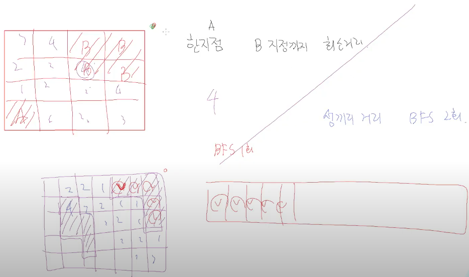
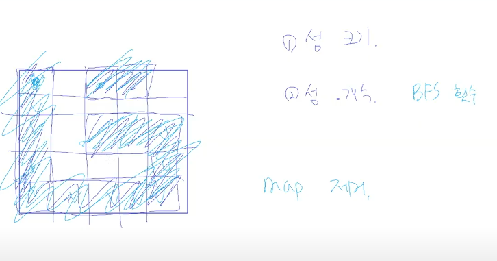
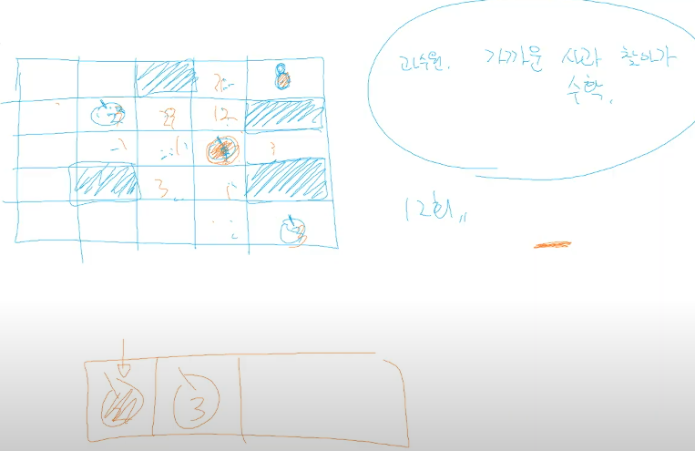
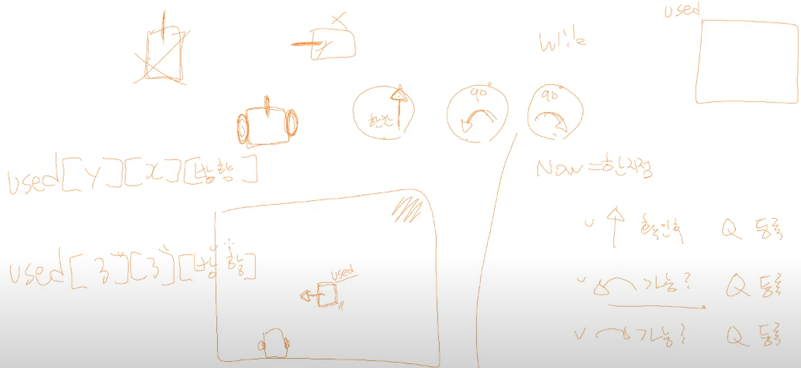
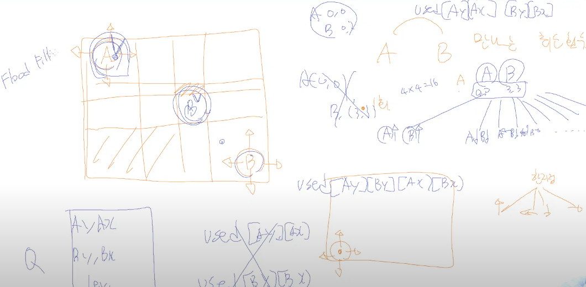

### 섬 사이 최단거리 구하기



섬에끼리 거리 는 먼저 아무 지점이나 찾은다음, 거기서 bfs를 돌려서 섬과 다이렉트로 연결 된 좌표 모두 구한 뒤 저장.

두번째로 dfs를 돌려서 가장 먼저 바다 넘어 육지에 닿은 숫자가 정답!

<hr>

<br>

### 섬 크기 or 개수 구하기



섬의 개수는 bfs 의 횟수이고,

섬의 크기는, 큐에 append된 만큼의 크기이다.

<hr>

<br>

### 모든 사과를 수확하기까지 이동 횟수 구하기



1. 시작점에서 bfs로 가장 가까운 사과까지 거리 구함. 해당 거리 cnt 에 누적

2. 해당 사과좌표를 새로운 시작점으로 다시 bfs돌리며 다음으로 가까운 사과까지의 거리를 구하는데,

   가장 가까운 사과로 이동. 마찬가지로 cnt에 누적

3. 또 반복

4. 정답 나올거임

<hr>

<br>

### 탱크문제



포인트:

1. 반문한 좌표만을 visited로 관리하는게 아니라, 

   해당 좌표를 방문했을시에 가지고 있는 방향도 visited로 관리를 해서,

   같은 좌표에 반복적으로 방문하더라도 현재 방향에 따라 방문을 막을 여부를 결정

<hr>

<br>

### 친구 만나기

a 와 b가 상하좌우로만 움직을 수만 있고, 서로 만나려한다.

a 와 b는 무조건 동시에 움직인다.

그들이 만날 수 있는 최소 움직이는 횟수를 구하라.



포인트:

1. 4차원배열로 visited관리 해야한다.

<hr>

<br>

### 견우와 직녀 문제

flood-fill 문제 설계 포인트:

1. best 배열 or used 배열 몇차원배열로 운영할지

2. 제약조건 어떻게 처리할것인지

3. level 어떻게 처리할것인지

견우직녀 노드 설계 예시:

- x, y 좌표
- 오작교 건설 스킬 사용 여부
- 갔는지 안갔는지 체크하는 배열
- 최고 기록. (필살기 쓰고 안쓰고도 따로 저장해놔야한다)
- 좌표 이동 시 변경되는 시간 값

예시 코드:

```java
#include <iostream>
#include <queue>
using namespace std;
int N, M;
int map[11][11];
int best[2][11][11];
int direct[4][2] = { -1, 0, 1, 0, 0, 1, 0, -1 };
struct Node {
	int y, x;
	int isUsedM;
	int lev;
};
queue<Node> q;
int getNextLev(int nowLev, int ny, int nx, int T)
{
	if (T == 1) return nowLev + 1;
	if (T == 0) T = M;
	return ((nowLev / T) + 1) * T;
}
int run()
{
	q.push({ 0, 0, 0, 0 });
	while (!q.empty()) {
		Node now = q.front();
		q.pop();
		for (int t = 0; t < 4; t++) {
			int ny = now.y + direct[t][0];
			int nx = now.x + direct[t][1];
			if (ny < 0 || nx < 0 || ny >= N || nx >= N) continue;
			if (now.isUsedM == 1 && map[ny][nx] == 0) continue;
			//새로운 다리를 사용할지 결정
			int nextUsedM = now.isUsedM;
			if (now.isUsedM == 0 && map[ny][nx] == 0) nextUsedM = 1;
			//절벽 연속 2개 방지
			if (map[now.y][now.x] != 1 && map[ny][nx] != 1) continue;
			
			//시간 계산하기
			int nextLev = getNextLev(now.lev, ny, nx, map[ny][nx]);
			
			//최적인지 확인
			if (best[nextUsedM][ny][nx] <= nextLev) continue;
			best[nextUsedM][ny][nx] = nextLev;
			q.push({ ny, nx, nextUsedM, nextLev });
		}
	}
	int mini = best[0][N - 1][N - 1];
	if (mini > best[1][N - 1][N - 1]) mini = best[1][N - 1][N - 1];
	return mini;
}
int main()
{
	ios::sync_with_stdio(0);
	//freopen("text.txt", "r", stdin);
	int tc;
	cin >> tc;
	for (int i = 1; i <= tc; i++) {
		cin >> N >> M;
		for (int y = 0; y < N; y++) {
			for (int x = 0; x < N; x++) {
				cin >> map[y][x];
			}
		}
		while (!q.empty()) q.pop();
		
		for (int y = 0; y < 11; y++) {
			for (int x = 0; x < 11; x++) {
				best[0][y][x] = 21e8;
				best[1][y][x] = 21e8;
			}
		}
		int ret = run();
		cout << "#" << i << " " << ret << endl;
	}
	return 0;
}
```


